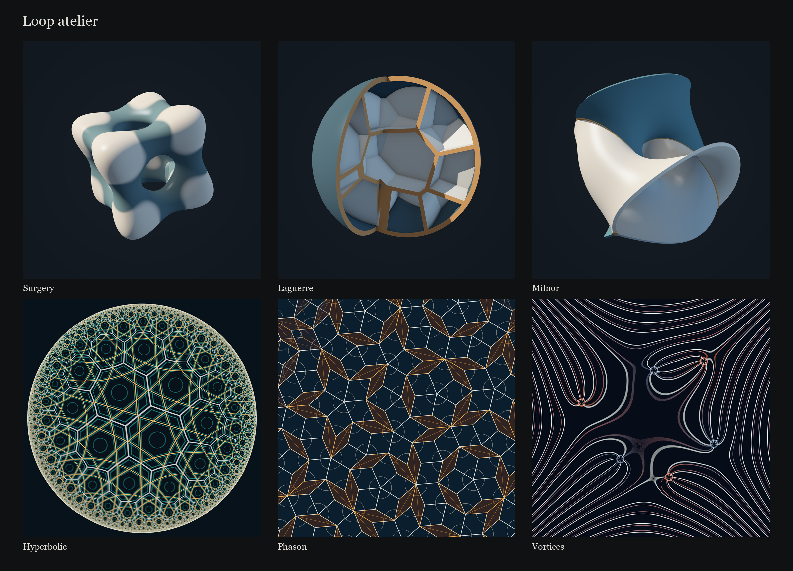

# Loop atelier

A reusable framework for seamless generative animation, with 26 original mathematical studies informed by Étienne Jacob’s published methods. Version 2.1.0 supports both particle geometry and RGB shaders, including opaque implicit surfaces, hyperbolic tiling and quasiperiodic tile changes.

**[Open the studio](https://www.davidpeterwallisfreeborn.com/fun/loop-atelier/)** · **[Download the full toolkit](https://github.com/DavidFreeborn/loop-atelier/releases/tag/v2.1.0)**

The studio has one alphabetical study selector, playback and composition controls, and the selected work’s construction note and equation. Sources contains the bibliography. Save a recipe or a lossless still without installing anything. The self-contained [`output/loop-atelier.html`](output/loop-atelier.html) also opens directly from disk and works offline.



This repository contains the complete source, offline studio, documentation, contact sheets and thumbnails. The release download additionally contains all 26 finished PNGs, all 26 MP4 loops, reproducible manifests, the movie gallery and detailed verification evidence. The [verification record](docs/validation-04.md) documents the mathematical, interface and publication checks. Earlier edition reports remain available as historical evidence.

## What is included

| Deliverable | Location |
|---|---|
| Self-contained interactive studio | [`output/loop-atelier.html`](output/loop-atelier.html) |
| 26 publication PNG stills at 2,400 × 2,400 | Release ZIP → `output/stills/` |
| 26 publication MP4 loops at 1,440 × 1,440 and 30 fps | Release ZIP → `output/loops/` |
| Film gallery with playback controls | Release ZIP → `output/gallery.html` |
| Source-grounded research dossier | [`docs/research.md`](docs/research.md) |
| Framework architecture and new-study guide | [`docs/toolkit.md`](docs/toolkit.md) |
| Collection 04 scope and mathematical documentation | [`docs/collection-04.md`](docs/collection-04.md) |
| Export commands and production guidance | [`docs/exporting.md`](docs/exporting.md) |
| Latest verification record | [`docs/validation-04.md`](docs/validation-04.md) |
| Completed Collection 03 verification record | [`docs/validation-03.md`](docs/validation-03.md) |
| Detailed production plan | [`PLAN.md`](PLAN.md) |

The exporter writes a JSON manifest beside each publication image or movie, recording its recipe, timing, browser, graphics backend and encoding settings. Exporter 2.1.1 supports explicit movie quality and prefers hardware-capable Chromium headless. The newest studies are **Surgery**, **Laguerre**, **Milnor**, **Hyperbolic**, **Phason** and **Vortices**; all 20 earlier studies remain in the same selector. Collection numbers organize the source and production records, not the studio interface. Publication presets use still phase 0.15 and movies without a duplicated endpoint. Curated durations and metadata are in `output/catalog.json`.

## Work with the source

The live renderer has **zero runtime dependencies**. It uses JavaScript modules, WebGL 2, and native browser controls. With Node.js 20 or newer:

```sh
npm start
```

Open `http://127.0.0.1:4173`. This serves the editable studio from `index.html`. The server is deliberately local. The self-contained version is an alternative for opening directly from disk.

For a working authoring example, open `http://127.0.0.1:4173/examples/replacement.html` while the server is running. It shows a queue of particles exchanging places, with the initialization code alongside the result. Edit `src/example.js` to make a different path.

```sh
node scripts/package.mjs
```

Packaging regenerates the self-contained studio from HTML, CSS and JavaScript source; it no longer embeds thumbnails. Tests cover mathematical continuity, actual GLSL evaluation, framing, replacement-state equivalence, and the local server. The GPU tests and offline export require Playwright and its Chromium browser:

```sh
npm install
npx playwright install chromium
npm test
node tests/browser-check.mjs
node tests/clean-studio-check.mjs --standalone
node scripts/render.mjs --scene meridian --format png --size 2400 --output output/my-meridian.png
```

For movies, install FFmpeg or `python -m pip install imageio-ffmpeg`. See the [export guide](docs/exporting.md) for commands and supported overrides. Publication masters require floating-point framebuffer support; the studio explains when a device cannot provide it.

## A different study in a few lines

```js
import { LoopRenderer } from './src/renderer.js';
import { createReplacementScene } from './src/example.js';

const renderer = new LoopRenderer(document.querySelector('canvas'));
renderer.resize(1200);
const scene = createReplacementScene({ count: 15000, seed: 42 });
renderer.render(scene, 0.2, {
  samples: 8, shutter: 0.65, fps: 30, duration: 8,
  camera: { yaw: 0.1, pitch: 0.3, distance: 3.4 },
  pointSize: 1.5, exposure: 1,
});
```

For the 14 particle studies, `scene.update(t, variation)` writes positions and light intensity into a reusable array. The renderer supplies projection, point coverage and temporal integration. The 12 shader studies implement `vec3 artwork(vec2 p)`, returning finite, nonnegative linear RGB radiance using shared phase, seed, variation and resolution uniforms. An implicit-surface shader supplies its own camera, intersection method and lighting. Both paths share exposure, output and recipes. The [toolkit guide](docs/toolkit.md) documents the contracts and their limits.

## The six additions

| Study | Construction |
|---|---|
| Surgery | A quartic level set crosses analytically known saddle levels, joining and separating components. |
| Laguerre | A weighted 3D power diagram forms walls inside a sphere opened by a moving section. |
| Milnor | Three argument levels of a complex polynomial on the three-sphere become cropped, thickened pages around a trefoil binding. |
| Hyperbolic | A regular `{7,3}` Poincaré-disk tessellation moves under a periodic Möbius isometry. |
| Phason | A dual pentagrid produces exact rhombi; local changes use optical crossfades between tile states. Transitional images are not claimed to be exact tilings. |
| Vortices | Three positive and three negative complex phase singularities reshape visible fringes. |

See the [geometry notes](docs/geometry-04.md) and [mathematics notes](docs/mathematics-04.md) for derivations, finite approximations and visual choices. The [export guide](docs/exporting.md) includes the current proof commands and `--new-only` workflow.

## Research and attribution

The main lesson is coherent geometry, well-organized time, and disciplined density. Jacob’s work also encompasses grids, recursion, packing, simulations, and many kinds of marks. Collection 01 explores filaments; Collection 02 extends that vocabulary into implicit surfaces, angular fields, and recursive motion. The research dossier covers a wider grammar.

The [artist’s tutorials](https://bleuje.com/tutorials/) explain periodic functions, spatial delays, circular noise, replacement queues, cached simulation paths, and the motion-blur template he credits to Dave Whyte / beesandbombs. Our renderer averages **linear radiance** before tone mapping, an explicit implementation choice that differs from averaging already encoded RGB pixels.

All included compositions, source code, and exported images are original to this project. Jacob’s artwork and published sketch code are not bundled or copied. This project is independent and is not affiliated with or endorsed by the artist. Source references retain their own rights.

## Website integration

The live studio is published on [David Freeborn’s website](https://www.davidpeterwallisfreeborn.com/fun/loop-atelier/). That site vendors `output/loop-atelier.html` from this repository and applies its navigation and metadata through its existing tool-sync workflow. The interactive renderer does not request movie files or depend on external services. Full-resolution publication assets are distributed through [GitHub Releases](https://github.com/DavidFreeborn/loop-atelier/releases).

After changing source, run `npm run package` and commit the generated studio and catalogue with it. GitHub Actions runs the tests and checks that those generated files match the source. Publication QA that reads stills, movies or historical reports requires the release ZIP or regenerated assets; the fresh-checkout `npm test` suite does not.
